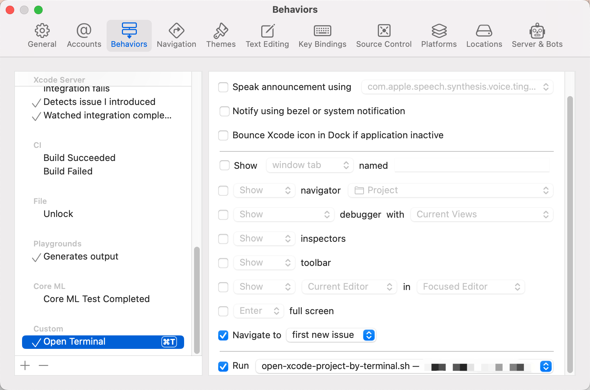
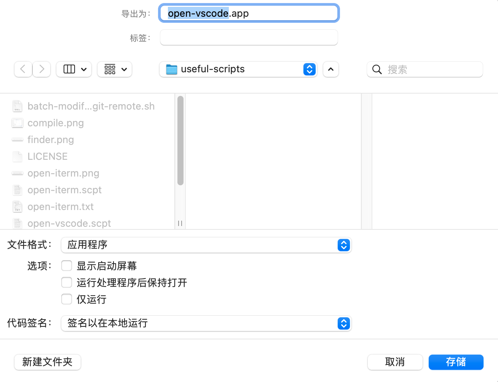

# Useful Scripts

[](https://github.com/huk10/useful-scripts/blob/master/LICENSE)

Some useful and practical scripts accumulated.

<!-- TOC depthFrom:1 depthTo:3 -->

- [🐚 Shell script](#-shell-script)
    - [batch-modify-git-remote.sh](#batch-modify-git-remote) 批量修改目录下所有 Git 仓库的的
      remote-url 用户名。
- [💻 Mac platform specific script](#-mac-platform-specific-script)
    - [open-xcode-project-by-terminal.sh](#open-xcode-project-by-terminal) 方便的在 Xcode
      打开位于当前项目路径的 iTerm 。
    - [start-emulator.sh](#start-emulator) 快捷在终端打开 Android Studio 的 Android 模拟器。
    - [open-vscode.scpt](#open-vscode) 可以在 Finder 上一键使用 vscode 打开当前选中的目录或文件。
    - [open-iterm.scpt](#open-iterm) 可以在 Finder 中一键打开 iTerm 并进入当前选中的目录或选中文件的所在目录。
- [License](#license)

<!-- /TOC -->

## 🐚 Shell script

### [batch-modify-git-remote.sh](./batch-modify-git-remote.sh) <a name="batch-modify-git-remote"></a>

当您需要更改 GitHub 用户名时，使用此脚本可以轻松更新指定目录下所有相关仓库的远程 URL。

- 只会处理指定的目录第一层，不会递归处理。
- 只支持 git 和 https 协议。
- 只支持 GitHub 的仓库。

**Usage**

```shell
./batch-modify-git-remote.sh ~/Developer/github/ NEW_NAME
```

## 💻 Mac platform specific script

### [open-xcode-project-by-terminal.sh](./open-xcode-project-by-terminal.sh) <a name="open-xcode-project-by-terminal"></a>

使用此脚本可以方便的通过 Xcode 的工具栏直接打开 iTerm 窗口并进入当前项目目录。

**Usage**

- 下载此脚本并保存至一个特殊目录中存放。
- 给此脚本添加执行权限。
- Xcode > Behaviors > Edit Behaviors... 新增一个配置

<details>
<summary>Xcode Behaviors 配置</summary>
<div align="center"></div>
</details>

### [start-emulator.sh](./start-emulator.sh) <a name="start-emulator"></a>

一键启动 Android Studio 的 Android 模拟器。

**Usage**

1. 确保已在Android Studio中安装并配置了模拟器。
2. 默认的配置名为 `android_11` 支持从命令行传递配置名称。
3. 命令运行后终端不要关闭。

```shell
./start-emulator.sh android_11
```

### [open-vscode.scpt](./open-vscode.scpt) <a name="open-vscode"></a>

<details>
<summary>效果图</summary>

</details>

可以在 Finder 中一键使用 Visual Studio Code 打开当前选中的目录或文件。

**Usage**

1. 使用系统自带的脚本编辑器应用，打开此[代码二进制源文件](./open-vscode.scpt)并导出为应用程序。
2. 将二进制文件拖到 Finder 工具栏上，即可使用。
3. 图标可自行寻找修改。

[代码二进制源文件](./open-vscode.scpt) | [代码文本文件](./open-vscode.txt)

<details>
<summary>导出为应用程序</summary>
<div align="center"></div>
</details>

### [open-iterm.scpt](./open-iterm.scpt) <a id="open-iterm"></a>

<details>
<summary>效果图</summary>

</details>

可以在 Finder 中一键打开 iTerm 并进入当前选中的目录或选中文件的所在目录。

*如果当前 Finder 窗口有选中的文件或目录，则新开 iTerm 窗口并 cd 到选中的目录或选中的文件所在目录，如果没有选择文件或目录则
cd 到当前窗口所在目录。*

*如果直接执行此脚本，会选择最近聚焦过的窗口（同时存在多个窗口也是此逻辑）进行操作，如果当前没有打开 Finder 窗口，则默认 cd
到 ~ 目录。*

**Usage**

1. 使用系统自带的脚本编辑器应用，打开此[代码二进制源文件](./open-iterm.scpt)并导出为应用程序。
2. 将二进制文件拖到 Finder 工具栏上，即可使用。
3. 图标可自行寻找修改。

[代码二进制源文件](./open-iterm.scpt) | [代码文本文件](./open-iterm.txt)

<details>
<summary>导出为应用程序</summary>
<div align="center"></div>
</details>

## License

The scripts and documentation in this project are released under the [MIT License](./LICENSE).

